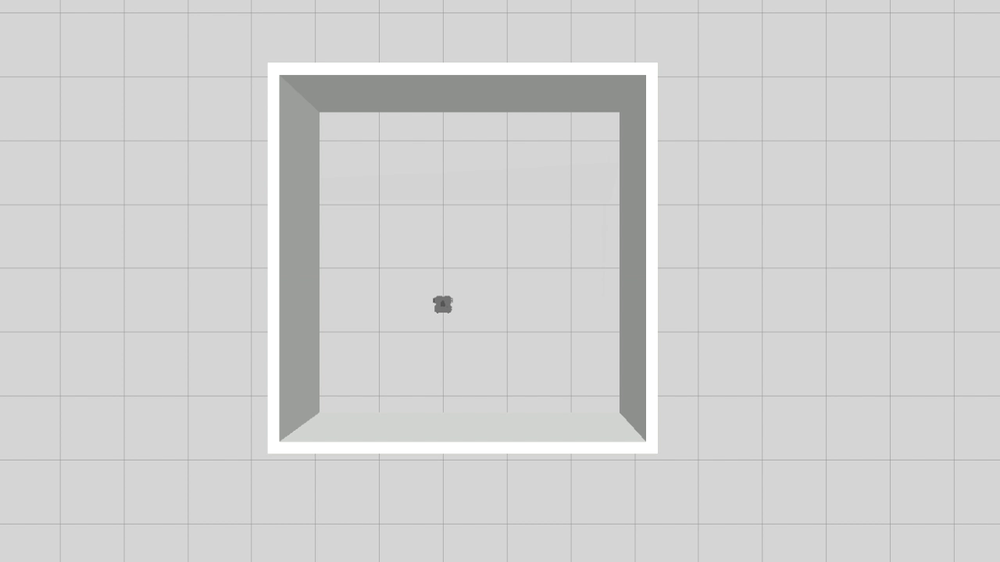

# warmup_project

### Zhou Xing 
##### zhouxing@uchicago.edu

Last Edit: Apr 12, 2021

## Driving in a Square

### Introduction
For this part, [./scripts/drive_square.py](./scripts/drive_square.py) controls a turtlebot3 model to run through a square path with side length 1. We use a timing strategy to make sure that the robot moves forward for a fixed duration for each side of the square, or changes direction with a fixed angular speed and duration as well. 

### Code Explanation

We wrote up the `drive_square.py` with OOP, specifically, to a `DriveSquare` object. We encapsulate two actions -- _move forward_, and _change direction_ -- into two methods `self.move_forward` and `self.turn_to`. And finally, use a `self.move` method to accomplish a pipeline of these two actions. 

For accurate tuning, we allow customization of the loop rate in each action, with a `self.loop_rate` attribute in `DriveSquare`'s `init` function. 

For both `self.move_forward` and `self.turn_to`, we are using a timing strategy, i.e. letting the robot to move a fix speed for a fixed duration. We also allow customization of these two parameters. We also force the robot to stop at the end of each move, either it's moving forward, or turning head.

For the `self.move` method, we simply let the robot to do `move_forward` and then `turn_to` for four times. 

### Demo gif

(Please wait for about 5 seconds at the beginning of the gif.)

## Wall Follower

### Introduction
For this part, [./scripts/wall_follower.py](./scripts/wall_follwer.py) controls a turtlebot3 model to run along the wall with a square contour. We use LaserScan to make sure that the robot knows its distance to wall ahead, and then makes use of that to decide what action -- rushing forward or taking left turn -- to take.

### Code Explanation

Similar to the `DriveSquare.py`, we wrote up this program using OOP. The code is mainly consist of three part: 
   1. Subscribe to current distance to the wall in front -- `self.get_cur_distance()`
   2. Use proportional control to adjust the forward / angular speed -- `self.set_vel()`
   3. Publish the speed to the speed controller channel, and repeat to step 1 -- `self.set_vel()`

(The code I actually ran was actually tricky: its feasibility relies strongly on the assumption that the walls are square on the inside. In fact, I also tried a more generalized algorithm: considering distances in multiple directions (front, right front, right, back right, left) as a way to determine the magnitude of the angular velocity. (Refer to the part I COMMENTED off) But I found that the test results were really bad and the turtle always drifted away, so I used an algorithm similar to walking a square.)

### Demo gif

## Person Follower

### Introduction
For this part, [./scripts/person_follower.py](./scripts/person_follower.py) controls a turtlebot3 model to search and approach an object in the neighborhood. We use LaserScan to make sure that the robot knows the related location of the object (namely, the distance and the angle), and switch the speed according to this information. Once the turtle finds it's close enough, it will stop moving.

### Code Explanation
Again, we are using OOP with a `Person_Follower` object. One of the most important tool is again the LaserScan. The code follows the idea below:

1. Use the LaserScan get the relative distance to any object on 360 degrees (all directions). 
2. Process the returned data from LaserScan, loop over the list, get the angle with the minimum distance (So that the turtle can run straight forward to the object, based on the assumption that the straight line between two points gives shortest distance, in $\mathbf{R}^2$) -- `self.get_closest_ang_dist()`
3. Change the turtle's linear and angular speed based on the info from step2. Specifically, we need to convert the degree from step 2 to radians, and pass it to the `/cmd_val` channel.
4. Back to step 1

### Demo gif

### Challenges

1. System setting: It took me the whole weekend to get my Gazebo work. It turns out that at the end reset my machine is the best solution lol. 
2. Parameter Tuning: I spent one hour to make sure my robot turn by a more accurate 90 degree. I also found that the robot is very sensitive to a slight change (<0.1) of angular speed. 
3. Roslaunch Issue: The in_room world issue caught me for a whole night. I didn't realize that resetting in this world will mess up the performance. 

### Future Work

1. Tune more and find more interesting things in controling the robot. I notice that though I set the robot to move forward, it tends to drift. Also, I used `self.speed_pub.publish(Twist())` to make the robot stop at the end of each move, but it seems that in some situation this would invoke the robot to turn as well. Not sure about this and will check it out later.

2. Try testing out more general case for the wall_follower.

### Takeaways

1. **Leave more time for the assignment**. Because you have no idea what bug the system would bring you. (I spent about 2 hours to finish the coding, but 2 days for the system set up.)
2. **The parameter tuning can be tricky**. I finally settled with a `0.502` for the angular speed for each turning, and a duration of `3`. It seems that for a more accurate performance of robot, sometimes I have to try many times for a magic number. 
